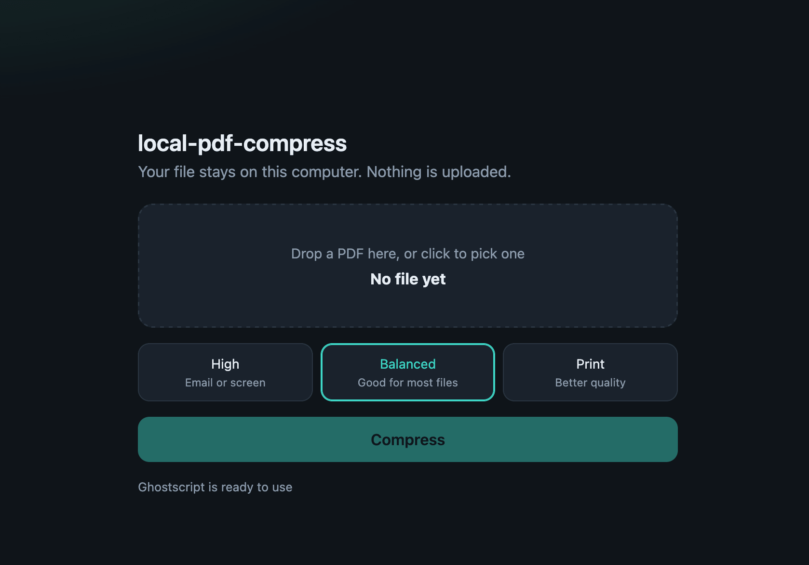

# local-pdf-compress

Compress PDF files on your computer with Python and Ghostscript. Files stay local. There is a simple web page and a command line tool.

It works best with scanned pages and PDFs that have photos. Nothing is uploaded.



```bash
git clone https://github.com/ozardali/local-pdf-compress.git
cd local-pdf-compress
```


## What you need

- Python 3.9 or newer (on a Mac, it is usually `/usr/bin/python3`)
- [Ghostscript](https://www.ghostscript.com/)

## Install Ghostscript

**macOS:** run this once. It uses Homebrew.

```bash
./setup.sh
```

**Debian / Ubuntu**

```bash
sudo apt install ghostscript
```

**Windows:** download Ghostscript from the [official site](https://www.ghostscript.com/releases/gsdnld.html). Then make sure `gswin64c` is in your `PATH`.

## Start the web page

**On a Mac:** after `./setup.sh`, double-click `start.command`. It only starts the app. It does not install Ghostscript. Your browser should open [http://127.0.0.1:8765](http://127.0.0.1:8765). If macOS says it cannot open the file, right-click it and choose **Open**.

**On any computer:** you can also run this in a terminal:

```bash
python3 server.py
```

Drop a PDF, choose a quality, then download the new file. The app only runs on your computer (`localhost`). Files go to a temp folder. They are not sent to the internet.

## Command line

```bash
python3 compress.py document.pdf
python3 compress.py document.pdf --quality high
python3 compress.py document.pdf -o smaller.pdf
python3 compress.py one.pdf two.pdf --quality medium
```

If you do not use `-o`, the new file is saved next to the old one, with the name `document-compressed.pdf`.

### Quality options

| Option   | Ghostscript setting | Good for              |
| -------- | ------------------- | --------------------- |
| `high`   | `/screen` (72 dpi)  | Email, reading on a screen |
| `medium` | `/ebook` (150 dpi)  | Daily use (default)   |
| `low`    | `/printer` (300 dpi)| Printing              |

Some PDFs are already small, especially text-only files. If the new file would be bigger, the tool keeps the original size.

## Files in this project

```
setup.sh         Install Ghostscript on a Mac (Homebrew)
compress.py      Command line tool
server.py        Local web page
web/index.html   Drag and drop page
start.command    Double-click this on a Mac to start
screenshot.png   Picture of the web page
```

You do not need to install extra Python packages.

Ghostscript is a separate program. It has its own license. This project only calls it. It does not copy Ghostscript source code.

## License

MIT. See [LICENSE](LICENSE).
